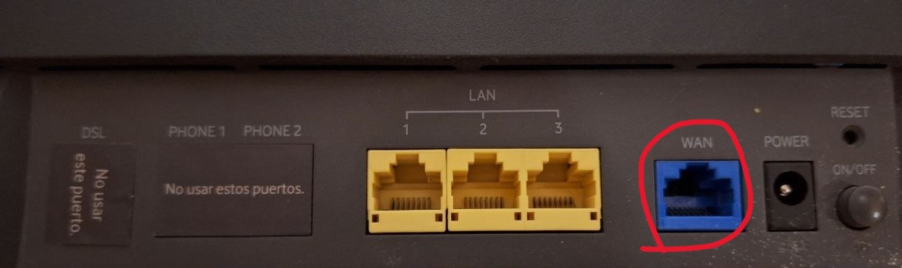

This post is a tutorial on how to retrieve the credentials from ISP (Internet Service Provider) locked-down routers. As you may know, some ISPs provide you with a router when you sign a contract with them. This router usually comes at no extra cost (included in the price). However, while this may seem convenient at first, you might encounter issues later on when trying to configure certain parameters within the router or due to its limited capabilities.

So, you decide to get a new router and replace the one provided by the ISP. This is where the big problem arises, as some ISPs will not provide you with the PPPoE credentials that your router uses to access their network. In this tutorial, we'll show you how to retrieve the credentials from an ISP router so that you can replace it with your own.

> In case you're hesitant about the legality of this, I'd like to mention that it is **legal**. At least in Europe, you have the right to access the internet with the devices of your choice, as specified in EU’s [Regulation (EU) 2015/2120](https://eur-lex.europa.eu/legal-content/EN/TXT/?uri=CELEX%3A32015R2120). Companies often try to obfuscate and make you jump through hoops for these credentials because operating their lockdown routers allows them to control settings, such as DNS, to more cost-effectively manage their network.
{: .prompt-info }

## What do I need?

For this to work, you will need the router that contains the PPPoE credentials, a computer with an Ethernet interface, and an Ethernet cable.

> The router must be an Ethernet WAN router, meaning it should have an Ethernet port for the WAN (Wide Area Network).
{: .prompt-info }

Because you most likely won't have internet access during the process, it’s convenient to download the required program beforehand. It can be found [here](https://github.com/guillermodotn/pppoe-retriever/releases/latest) for Linux, Windows, and Mac.

__GitHub repo: [https://github.com/guillermodotn/pppoe-retriever](https://github.com/guillermodotn/pppoe-retriever)__

> The program is packaged as a frozen binary, which is a Python script bundled with all its dependencies and interpreter into a single binary/executable. This makes it easy to use, as you won’t need to install anything on your system. Just download it, run it once, and then you can easily remove it.
{: .prompt-info }

## Before running the script

Before running our script, we need to do two things.

### 1. Find interface name

The first step is to identify the name of the Ethernet port interface on our computer. This can be tricky if we have more than one Ethernet port.

A good trick is to list the network interfaces with the Ethernet cable disconnected, then connect the cable and list them again. This will help you identify which interface corresponds to which port.

#### On Windows

```shell
>  netsh interface show interface
```
{: .nolineno }

This will show an output similar to:

```shell
Admin State    State          Type             Interface Name
-------------------------------------------------------------------------
Enabled        Connected      Dedicated        WiFi
Enabled        Disconnected   Dedicated        Ethernet
```
{: .nolineno }

We need to check for the change in the `State`column and remember the `Interface Name`.

#### On Mac

```bash
$ ipconfig
```
{: .nolineno }


#### On Linux

Here, you can use the same command as on a Mac, or the more recommended one.

```bash
$ nmcli device status
```
{: .nolineno }

This command will show an output as follows:

```bash
DEVICE  TYPE      STATE        CONNECTION 
wlp2s0  wifi      connected    some-network5G
eth0    ethernet  unavaliable  --
lo      loopback  unmanaged    --
```


### 2. Connect the router to our PC

Now that we have identified the port, we need to connect our router with the PPPoE credentials to it. This connection will be done in a specific way: the cable should go from the WAN (Wide Area Network) port on our router to the PC.

The WAN port on our router is the one that communicates with the exterior of our LAN (Local Area Network). Domestic routers usually have a single WAN port, which is easily distinguishable from the LAN ports where we connect our devices.


_Router Port Configuration_


## Let's run the script

Finally, all that's left to do is run our script/program to collect the credentials.

For that, we will need two pieces of information:

- [X] Network interface name
- [ ] VLAN ID

> Ethernet VLANs (Virtual Local Area Networks) are used to segment and manage network traffic efficiently within a larger network. By creating separate VLANs, ISPs can isolate their network from other providers as well as segment different types of traffic, such as data, voice, and TV, along with managing their priorities. A VLAN is identified by a 12-bit number that ranges from 1 to 4095.
{: .prompt-info }

> To find out your ISP's VLAN in Spain, you can refer to [FTTH_Spain](https://wiki.bandaancha.st/Identificadores_VLAN_operadores_FTTH?ref=florianjensen.com).
{: .prompt-tip }

If you can't find your VLAN, you can use the -r option in the script with the number of VLANs to try. This will attempt all VLANs between 1 and the number passed as an argument.


### Windows

#### Known VLAN

```shell
> pppoe-retriever-windows-latest.exe -i <interface> -l <vland_id>
```
{: .nolineno }

#### Unknown VLAN

```shell
> pppoe-retriever-windows-latest.exe -i <interface> -r <range>
```
{: .nolineno }

### UNIX

#### Known VLAN

```bash
$ chmod +x pppoe-retriever-unix-latest
$ sudo ./pppoe-retriever-unix-latest -i <interface> -l <vland_id>
```
{: .nolineno }

#### Unknown VLAN

```bash
$ chmod +x pppoe-retriever-unix-latest
$ sudo ./pppoe-retriever-unix-latest -i <interface> -r <range>
```
{: .nolineno }

> On unix sistems the program should be run with `root` privileges.
{: .prompt-info }


Finally, let it work its magic.


> If you stumble upon this post before getting a new router, I suggest checking out [GL-iNet](https://www.gl-inet.com/) hardware, These routers offer great value, in my opinion, and come with their own version of [OpenWRT](https://openwrt.org/) pre-installed. You also have the option to install the vanilla version with full compatibility.
{: .prompt-tip }